# Jenkins Pipeline for Kubernetes Cluster

This project is a microservice-based eCommerce web application built with React, Node.js, Express, and MongoDB. It implements an API Gateway and multiple microservices including User, Product, Cart, and Order services.

## 🏗️ Architecture Overview

This application demonstrates modern microservices architecture with the following components:

```
Frontend (React) → API Gateway → Microservices
                                    ├── User Service (3001)
                                    ├── Product Service (3002)
                                    ├── Cart Service (3003)
                                    └── Order Service (3004)
```

## 🔧 Technology Stack

### Backend
- **Runtime**: Node.js with Express.js
- **Database**: MongoDB with Mongoose ODM
- **Authentication**: JWT tokens
- **Architecture**: RESTful APIs with microservices

### Frontend
- **Framework**: React 18
- **Routing**: React Router
- **State Management**: React Query + Context API
- **HTTP Client**: Axios
- **Styling**: CSS3 with responsive design

## 📦 Microservices

### 1. User Service (Port 3001)
- User registration and authentication
- Profile management
- JWT token generation and validation
- User data persistence

**Endpoints:**
- `POST /api/auth/register` - User registration
- `POST /api/auth/login` - User authentication
- `GET /api/auth/me` - Get current user
- `GET /api/users/profile` - Get user profile
- `PUT /api/users/profile` - Update user profile

### 2. Product Service (Port 3002)
- Product catalog management
- Category management
- Product search and filtering
- Inventory tracking

**Endpoints:**
- `GET /api/products` - Get products with filtering/pagination
- `GET /api/products/:id` - Get single product
- `POST /api/products` - Create product (admin)
- `PUT /api/products/:id` - Update product (admin)
- `DELETE /api/products/:id` - Soft delete product (admin)
- `GET /api/categories` - Get all categories
- `POST /api/categories` - Create category (admin)

### 3. Cart Service (Port 3003)
- Shopping cart management
- Add/remove/update cart items
- Cart validation
- Integration with Product Service

**Endpoints:**
- `GET /api/cart/:userId` - Get user's cart
- `POST /api/cart/:userId/items` - Add item to cart
- `PUT /api/cart/:userId/items/:productId` - Update cart item
- `DELETE /api/cart/:userId/items/:productId` - Remove cart item
- `DELETE /api/cart/:userId` - Clear entire cart
- `POST /api/cart/:userId/validate` - Validate cart items

### 4. Order Service (Port 3004)
- Order creation and management
- Payment processing simulation
- Order status tracking
- Integration with Cart and Product Services

**Endpoints:**
- `GET /api/orders/user/:userId` - Get user's orders
- `GET /api/orders/:id` - Get single order
- `POST /api/orders` - Create new order
- `PUT /api/orders/:id/status` - Update order status
- `DELETE /api/orders/:id` - Cancel order
- `POST /api/payments/process` - Process payment
- `POST /api/payments/refund` - Process refund

**Frontend (frontend/.env)**
- REACT_APP_USER_SERVICE_URL=http://localhost:3001
- REACT_APP_PRODUCT_SERVICE_URL=http://localhost:3002
- REACT_APP_CART_SERVICE_URL=http://localhost:3003
- REACT_APP_ORDER_SERVICE_URL=http://localhost:3004

Connects the React app with all backend services.

## 🚀 Getting Started

### Prerequisites
- Node.js 16+ and npm
- MongoDB (local or cloud instance)

### Installation

1. **Clone the repository**
```bash
git clone https://github.com/sainathislavath/Jenkins-Pipeline-for-Kubernetes-Cluster
cd Jenkins-Pipeline-for-Kubernetes-Cluster
```

2. **Install dependencies for each service**
```bash
# Install root dependencies
npm install

# Install User Service dependencies
cd backend/user-service && npm install

# Install Product Service dependencies
cd ../product-service && npm install

# Install Cart Service dependencies
cd ../cart-service && npm install

# Install Order Service dependencies
cd ../order-service && npm install

# Install Frontend dependencies
cd ../../frontend && npm install
```

3. **Set up environment variables**

Create `.env` files in each service directory:

**backend/user-service/.env:**
```env
PORT=3001
MONGODB_URI=mongodb://localhost:27017/ecommerce_users
JWT_SECRET=your-jwt-secret-key
```

**backend/product-service/.env:**
```env
PORT=3002
MONGODB_URI=mongodb://localhost:27017/ecommerce_products
```

**backend/cart-service/.env:**
```env
PORT=3003
MONGODB_URI=mongodb://localhost:27017/ecommerce_carts
PRODUCT_SERVICE_URL=http://localhost:3002
```

**backend/order-service/.env:**
```env
PORT=3004
MONGODB_URI=mongodb://localhost:27017/ecommerce_orders
CART_SERVICE_URL=http://localhost:3003
PRODUCT_SERVICE_URL=http://localhost:3002
USER_SERVICE_URL=http://localhost:3001
```

**frontend/.env:**
```env
REACT_APP_USER_SERVICE_URL=http://localhost:3001
REACT_APP_PRODUCT_SERVICE_URL=http://localhost:3002
REACT_APP_CART_SERVICE_URL=http://localhost:3003
REACT_APP_ORDER_SERVICE_URL=http://localhost:3004
```

### Running the Application

**Option 1: Run all services concurrently (from root directory)**
```bash
npm run dev
```

**Option 2: Run services individually**

Terminal 1 - User Service:
```bash
cd backend/user-service && npm start
```

Terminal 2 - Product Service:
```bash
cd backend/product-service && npm start
```

Terminal 3 - Cart Service:
```bash
cd backend/cart-service && npm start
```

Terminal 4 - Order Service:
```bash
cd backend/order-service && npm start
```

Terminal 5 - Frontend:
```bash
cd frontend && npm start
```

The application will be available at:
- Frontend: http://localhost:3000
- User Service: http://localhost:3001
- Product Service: http://localhost:3002
- Cart Service: http://localhost:3003
- Order Service: http://localhost:3004

## 📁 Project Structure

```
ecommerce-microservices/
├── backend/
│   ├── user-service/
│   │   ├── models/
│   │   ├── routes/
│   │   ├── middleware/
│   │   ├── server.js
│   │   ├── .env
│   │   ├── Dockerfile
│   │   └── package.json
│   ├── product-service/
│   │   ├── models/
│   │   ├── routes/
│   │   ├── server.js
│   │   ├── .env
│   │   ├── Dockerfile
│   │   └── package.json
│   ├── cart-service/
│   │   ├── models/
│   │   ├── routes/
│   │   ├── server.js
│   │   ├── .env
│   │   ├── Dockerfile
│   │   └── package.json
│   └── order-service/
│       ├── models/
│       ├── routes/
│       ├── server.js
│       ├── .env
│       ├── Dockerfile
│       └── package.json
├── frontend/
│   ├── public/
│   ├── src/
│   │   ├── components/
│   │   ├── contexts/
│   │   ├── pages/
│   │   ├── services/
│   │   ├── App.js
│   │   └── index.js
│   ├── .env.js
│   ├── Dockerfile
│   └── package.json
├── package.json
└── README.md
```

## 🔧 API Testing

You can test the APIs using tools like Postman or curl:

```bash

# Register a new user
curl -X POST http://localhost:3001/api/auth/register \
  -H "Content-Type: application/json" \
  -d '{"firstName":"John","lastName":"Doe","email":"john@example.com","password":"password123"}'

# Get products
curl http://localhost:3002/api/products

# Get categories
curl http://localhost:3002/api/categories
```
## Dockerizing the Application

To make this application production-ready and deployable in scalable environments (like Kubernetes or Docker Compose), it's essential to create Docker images for each service.

Below are instructions to create Dockerfiles for each microservice and the frontend.

## Backend Services Dockerfile

Use the following Dockerfile for each backend microservice (User, Product, Cart, and Order services):
```Dockerfile
# Use official Node.js image
FROM node:18

# Set working directory
WORKDIR /app

# Copy package files and install dependencies
COPY package*.json ./
RUN npm install

# Copy all source files
COPY . .

# Port is injected dynamically via runtime configs like Kubernetes or Docker Compose
EXPOSE $PORT

# Start the service
CMD ["npm", "start"]
```

### Explanation:

- FROM node:18: Uses the stable Node.js 18 base image.

- WORKDIR /app: All commands will run inside /app.

- COPY package*.json ./ && npm install: Installs all required dependencies.

- COPY . .: Copies your entire project into the image.

- EXPOSE $PORT: Documented for future use (actual value can be provided via environment).

- CMD ["npm", "start"]: Starts the server.

**Note:** Environment variables like PORT and MONGODB_URI will be injected via .env during local testing, or by Kubernetes ConfigMaps/Secrets in production.

## Frontend React App Dockerfile
```Dockerfile
# Stage 1: Build
FROM node:18 AS builder
WORKDIR /app
COPY package*.json ./
RUN npm install
COPY . .
RUN npm run build

# Stage 2: Serve with Nginx
FROM nginx:alpine
COPY --from=builder /app/build /usr/share/nginx/html
EXPOSE 80
```

### Explanation:

    Stage 1 (builder)

        Installs the frontend dependencies.

        Builds the production version of the React app (npm run build).

    Stage 2 (nginx)

        Copies built assets to Nginx's default static serve directory.

        Serves the frontend on port 80.

This makes the frontend lightweight and production-optimized using Nginx.

## Build & Push Docker Images to DockerHub
To push your Dockerized services to Docker Hub, you can create and run a simple script.

## Bash Script Sample
```Bash
#!/bin/bash

# Login to DockerHub
docker login

# Replace this with your Docker Hub username
DOCKER_USER=<YOUR_DOCKERHUB_USERNAME>

# Build & push backend images
for svc in user product cart order; do
  echo "Building $svc-service..."
  cd backend/${svc}-service
  docker build -t $DOCKER_USER/${svc}-service:latest .
  docker push $DOCKER_USER/${svc}-service:latest
  cd - > /dev/null
done

# Build & push frontend
echo "Building frontend..."
cd frontend
docker build -t $DOCKER_USER/frontend:latest .
docker push $DOCKER_USER/frontend:latest
cd - > /dev/null
```

## Notes:
- Ensure that each Dockerfile is placed in the root of its respective service directory.

- Make sure all services run without error individually before building and pushing.

- Replace <YOUR_DOCKERHUB_USERNAME> with your actual Docker Hub username.

## Kubernetes Setup for Microservice Application

To run this app inside Kubernetes (local or production), we will deploy MongoDB, backend microservices, and the frontend using Kubernetes-native resources like Deployments, Services, ConfigMaps, and PersistentVolumeClaims.

## Key Kubernetes Concepts
### ⚙️ Key Kubernetes Concepts

| Resource | Purpose |
|---|---|
| Deployment | Manages Pods and handles scaling, updating, and self-healing. |
| Pod | A group of one or more containers that run together. |
| Service | Exposes a group of Pods via a consistent DNS name. |
| ConfigMap | Stores non-sensitive environment variables like .env. |
| PersistentVolumeClaim | Binds storage to MongoDB so it persists across restarts. |

### MongoDB in Kubernetes
We need to:

    Run the MongoDB container.

    Persist the data using a PersistentVolumeClaim.

    Allow internal access via a service.

### Backend Microservices (user-service.yaml, and others)
Each service has:

    ConfigMap for environment variables.

    Deployment for app instances.

    Service for internal DNS/IP routing.

### Traffic Flow Overview:
```bash
Browser (NodePort 30000)
    ↓
frontend (React)
    ↓
order-service
    ↳ cart-service
    ↳ product-service
    ↳ user-service
         ↳ MongoDB
```
Everything except the frontend entrypoint runs inside the Kubernetes cluster.

### Apply Kubernetes Resources
Once your Docker images are pushed to DockerHub:
```bash
kubectl apply -f k8s/
```

### Monitoring & Verification:
```bash
kubectl get pods         # Check pod status
kubectl get services     # See exposed services
```

You should see:
```bash
NAME             TYPE        CLUSTER-IP      EXTERNAL-IP   PORT(S)         AGE
frontend         NodePort    10.x.x.x        <none>        80:30000/TCP    3m
user-service     ClusterIP   10.x.x.x        <none>        3001/TCP        3m
...
```
## Deploying to AWS EKS (Elastic Kubernetes Service)
### Prerequisites
- AWS CLI configured (aws configure)
- eksctl, kubectl, and docker installed
- Docker images pushed to DockerHub

Step 1: Create EKS Cluster
```bash
eksctl create cluster \
  --name node-deployment \
  --region ap-south-1 \
  --nodegroup-name standard-workers \
  --node-type t2.micro \
  --nodes 2 \
  --nodes-min 1 \
  --nodes-max 3
```

Takes ~10–15 mins. It sets up:
- The VPC
- Control Plane
- Nodegroup
- Security policies

Step 2: Connect Local kubectl
```bash
aws eks --region ap-south-1 update-kubeconfig --name node-deployment

kubectl get nodes
```
You should see a few EC2 nodes ready.

Step 3: Create Directory Structure
```bash
k8s/
├── cart-deployment.yml
├── cart-service-config.yml
├── cart-service.yml
├── frontend-config.yml
├── frontend-deployment.yml
├── frontend-service.yml
├── mongo-deployment.yml
├── mongo-namespace.yml
├── mongo-service.yml
├── order-deployment.yml
├── order-service-config.yml
├── order-service.yml
├── product-deployment.yml
├── product-service-config.yml
├── product-service.yml
├── pv.yml
├── pvc.yml
├── user-deployment.yml
├── user-service-config.yml
└── user-service.yml
```

#### Each file contains:
- A Deployment
- A Service
- A ConfigMap

Step 4: Apply All Kubernetes Resources
```bash
kubectl apply -f k8s/
```

Watch app spin up:
```bash
kubectl get pods
kubectl get svc --watch
```

## CI/CD Pipeline with Jenkins
This section explains how to automate the build and deployment of your microservices to Amazon EKS using Jenkins.

### Assumptions

Before using the pipeline:

   You have:

    Jenkins agents with docker, kubectl, and aws CLI installed

    Jenkins credentials set up for:

        Docker Hub username (dockerhub-username)

        Docker Hub password (dockerhub-password)

    Your Kubernetes YAML files are in: k8s/

    Each backend service and frontend has its own Dockerfile

### Jenkins Declarative Pipeline
Add the Jenkinsfile to the root of your repository which is provided in the repo

### Pipeline Breakdown
| Stage | Description |
|---|---|
| Checkout Code | Pulls code from your GitHub repository |
| Build and Push Docker Images | Uses the Dockerfiles from each service directory to build and push images to Docker Hub |
| Update Kubeconfig | Ensures kubectl points to the right EKS cluster |
| Deploy to EKS | Applies your Kubernetes manifest files from the k8s/ directory |

### Credentials in Jenkins

Go to Jenkins → Manage Jenkins → Credentials and add:

    A Username + Password credential:

        ID: dockerhub-username

        Username: your Docker Hub username

    ID: dockerhub-password

        Secret: your Docker Hub password or token

#### What This Pipeline Does

Once configured, the pipeline will:

    Clone your code from GitHub

    Build and push updated service images to Docker Hub

    Refresh the kubectl context to your AWS EKS cluster

    Apply the Kubernetes YAML definitions from the k8s/ directory

#### Run the Pipeline

To start the pipeline:

    Commit the Jenkinsfile to your main branch

    Create and configure a Jenkins job (or use GitHub webhook to auto-trigger)

    Watch the stages complete under Jenkins UI


## Sceenshots
- Build the dockerfile for cart services

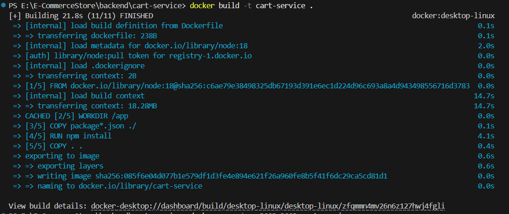

- Run and push the dockerfile for cart services

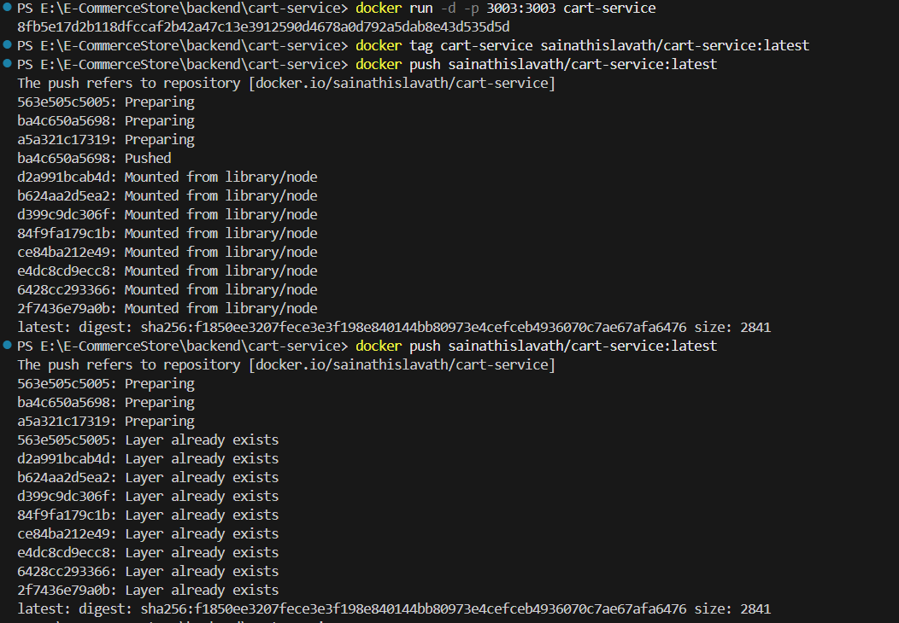

- Build the dockerfile for order services

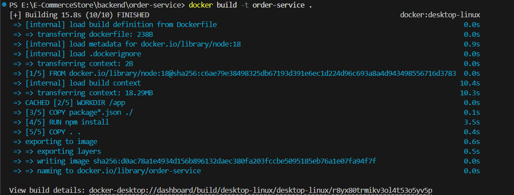

- Run the dockerfile for order services
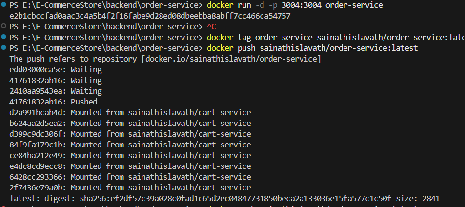

- Push the dockerfile for order services

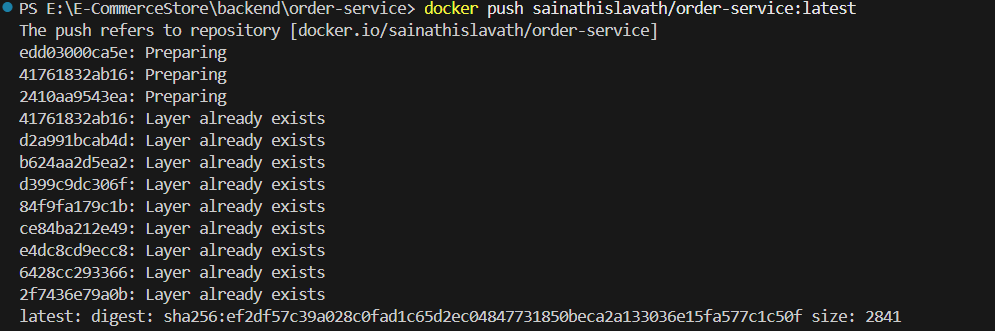

- Build the dockerfile for product services

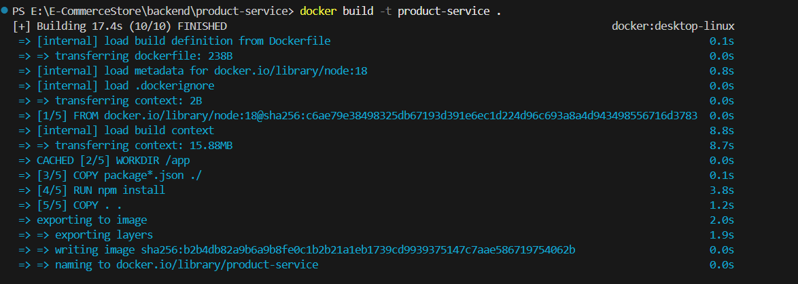

- Run and push the dockerfile for product services

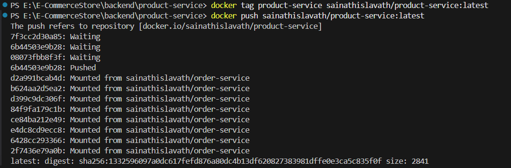

- Build the dockerfile for user services

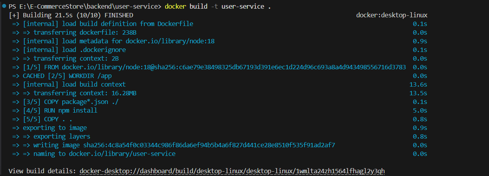

- Run and push the dockerfile for user services

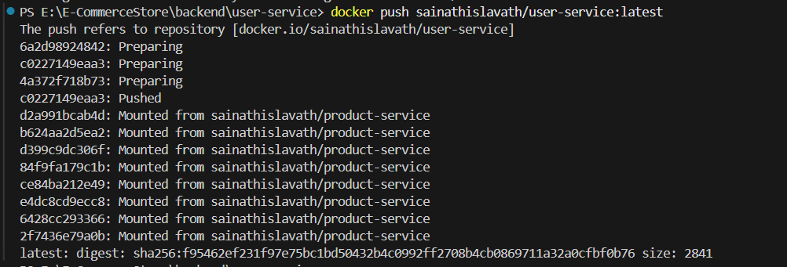

- Build the dockerfile for frontend services

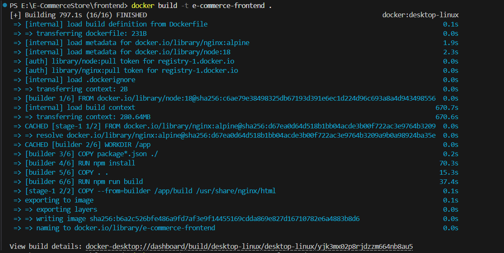

- Run and push the dockerfile for frontend services

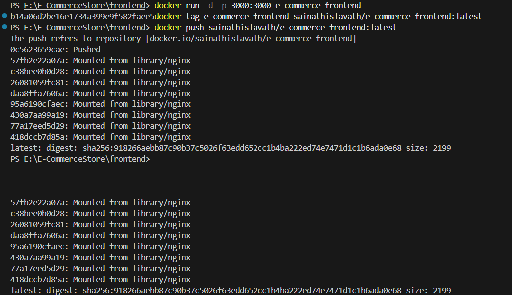

- Apply all the Kubernetes Resources

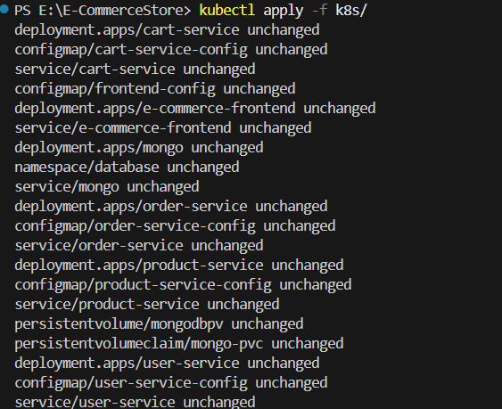

- Test the application in the browser

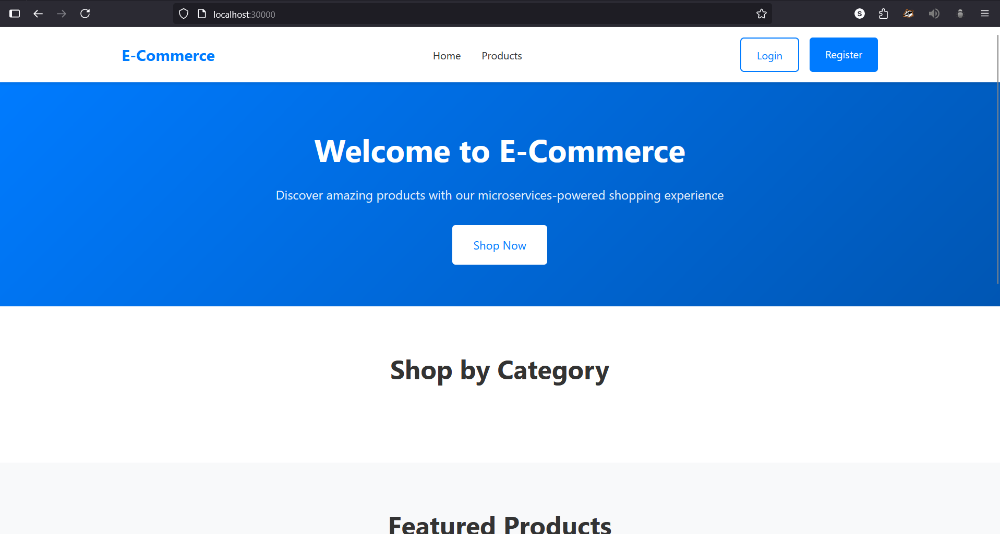

- Create EKS Cluster

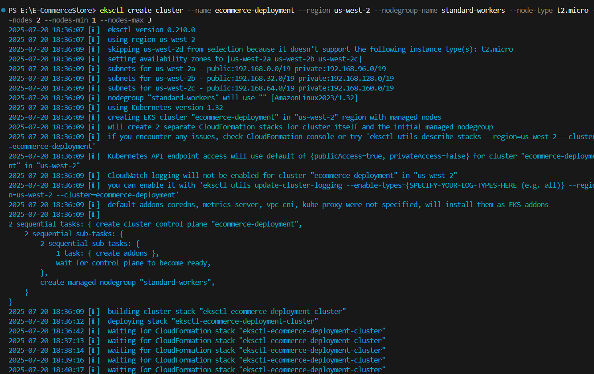

- Connect Local kubectl

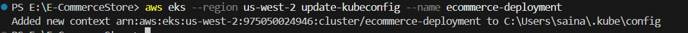

- check the nodes

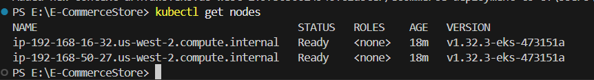

- Apply all the Kubernetes Resources

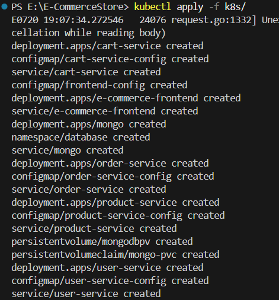

- check the pods

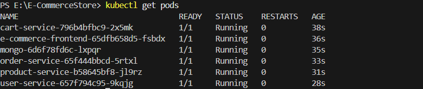

- Watch the services

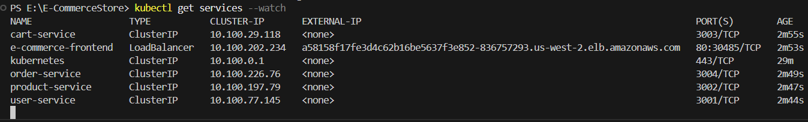

- Test it in the browser using the cluster

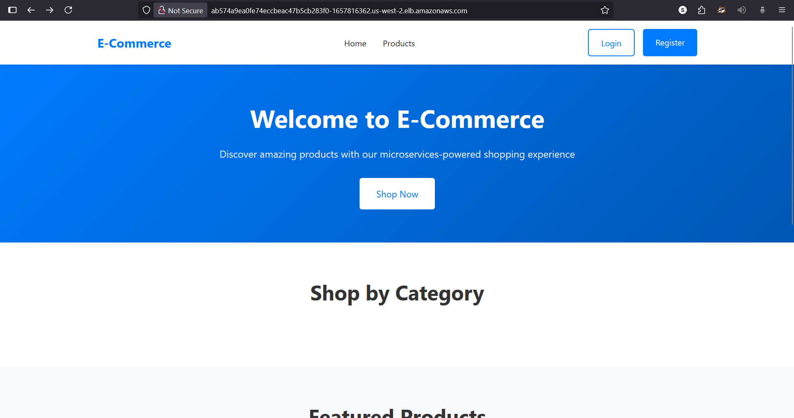

- After building the CI/CD Pipeline check the Console Output in the Jenkins

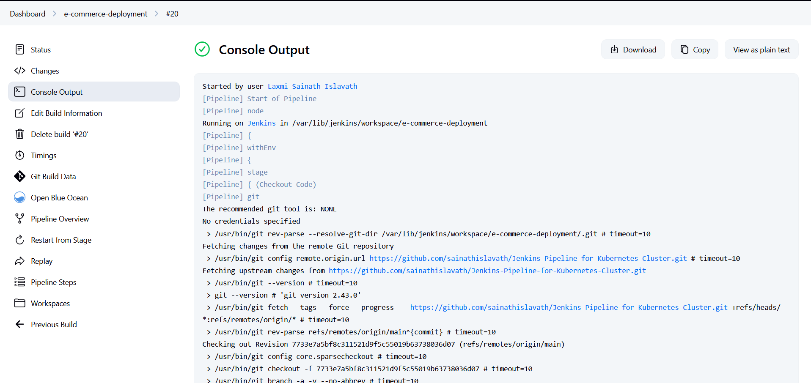

- Success Pipelines

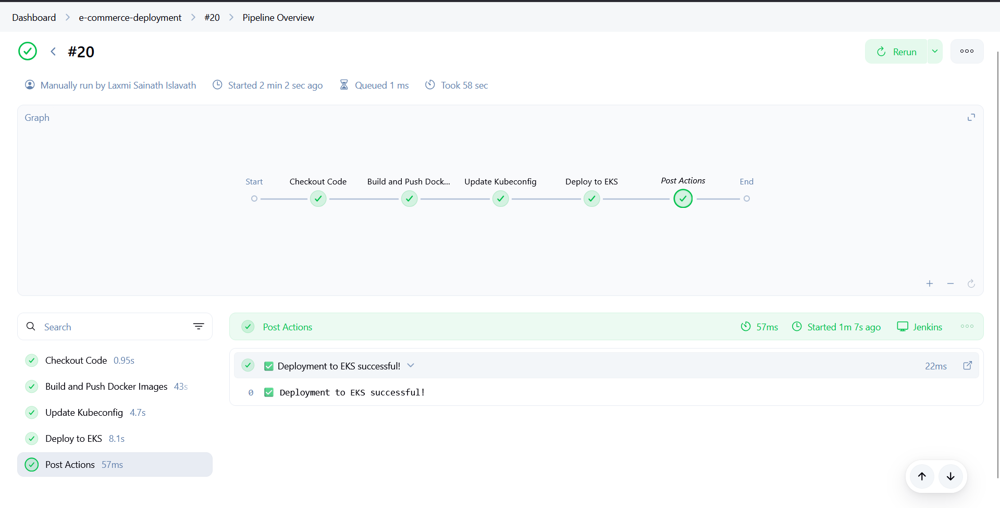